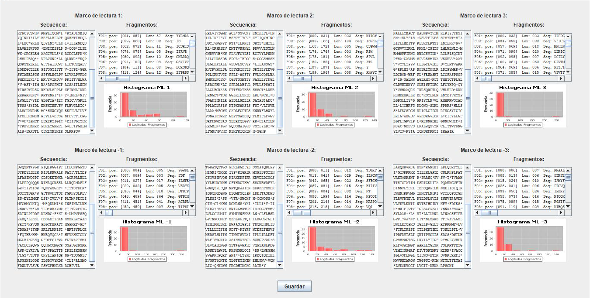

# DNATranslatorAnalyzer

This DNA sequence analyzer is in charge of constructing the reverse and reverse complementary sequences of the one provided in the input fasta file, calculating the nucleotide frequency percentages, translating the original sequence into the six possible reading frames and finally detecting fragments between stop codons in each case.

Two versions of this tool have been developed, one with a graphical interface and another without an interface. The final product of this software package is a PDF containing all the calculated information from the input FASTA file, including some diagrams that facilitate the understanding of this information.

## Version with graphical interface

To run it, simply invoke it from the console without the need to add input parameters, as the FASTA file to be used will be specified during the development of the interface.

```sh
java -jar DNATranslationAnalyzerInterface-PDF.jar
```

Once the program is launched, it will display a window where we can determine the FASTA file to use for generating the corresponding information:

<div align="center">
    
</div>

Once the button is pressed, all the fields will be filled in, displaying the following information:


Formatted representations of the read sequence and the reverse complement sequence will be shown. Additionally, the percentages are provided along with the corresponding bar chart. If we agree with the selected file, we click the "Translate" button, which opens a new window with the following information:



For each reading frame, the translated amino acid sequence is displayed, along with information about the fragments generated by stop codon cuts, and finally, the corresponding histogram representing the distribution of the lengths of these fragments. If the user wants to save all the generated information from the interface, they click the "Guardar" button. This will display a window informing about the success of the operation and the name of the output file in PDF format.


## Version without graphical interface

If the user wants to generate the PDF without using the interface, they can run this program to minimize the time it takes to obtain the result. In this case, since there is no interface, it will be necessary to specify the input FASTA file as a parameter in the invocation.

```sh
java -jar DNATranslationAnalyzer-PDF.jar "TYLCV.fna"
```